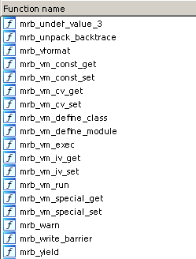
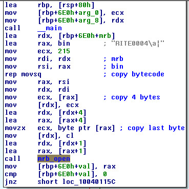
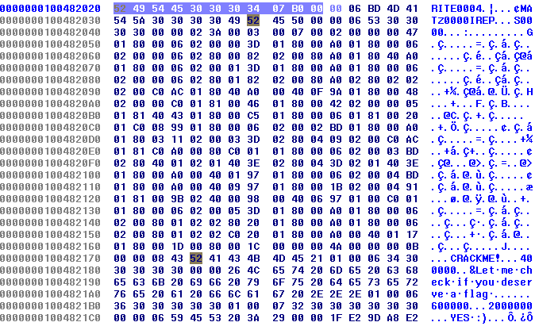
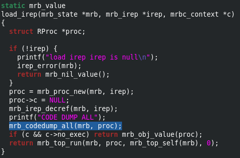

ECW 2017 - Red Diamond 
===============

### Sommaire
* Reconnaissance
* Extraction du byte code
* Configuration de mruby
* Validation du mot de passe
* Get the flag ! 

##### Reconnaissance
Le fichier est un exécutable compilé en 64 bits pour Windows. On remarque que le binaire embarque un interpréteur au vu des symboles.

 

**mrb** fait réference à  [https://github.com/mruby/mruby](https://github.com/mruby/mruby). mruby est un interpréteur de byte code ruby.

Après avoir télécharger le source de mruby, on remarque que l'interpréteur commence par appeler la fonction mrb_open, ce qui  permet de trouver le début du programme.

##### Extraction du byte code
Dans le challenge on trouve avec IDA une fonction f qui utilise la fonction mrb_open. La fonction f copie 1725 octets dans un buffer (nommé mrb sur l'image). 

Plus loin dans la fonction le buffer est passé en paramètre à la fonction mrb_load_irep, on comprend vite que la fontion prend le byte code en argument. On extrait le byte code  ruby avec IDA (en utilisant Hex View).

 

##### Configuration de mruby
Maintenant on va pouvoir lancer le byte code avec mruby. J'ai modifié la fonction mrb_load_irep pour afficher les mnémoniques mruby au chargement de chaque bloc de byte code.

 

On compile puis on lance l'interpréteur modifié,

	$ make
	$ ./build/host/bin/mruby -b bytecode_ruby.rbm
	[...]
	CRACKME!
	NoMethodError: undefined method 'usleep' for main
	
Comme on peut le voir dans le résultat de la commande ci-dessus, il manque des modules (gem) dans notre interpréteur pour pouvoir lancer le programme. Il faut installer les modules dont le programme a besoin. On modifie le fichier de configuration build_config.rb
	
	conf.gem :core => 'mruby-eval'
	conf.gem :github => 'mattn/mruby-md5'
  	conf.gem :github => 'mattn/mruby-iconv'
 	conf.gem :github => 'matsumotory/mruby-sleep'
  	conf.gem :github => 'iij/mruby-pack'
  	
On recompile, puis on relance

 	$ make
 	$ ./build/host/bin/mruby -b bytecode_ruby.rbm password
 	CRACKME!
	Let me check if you deserve a flag ...
	NO :(

##### Validation du mot de passe

Dans le byte code on remarque un bout de code intéressant,

	019 OP_LOADI	R9	254	
	020 OP_LOADI	R10	255	; BOM
	021 OP_LOADI	R11	0	
	022 OP_LOADI	R12	65	'A'
	023 OP_LOADI	R13	0	
	024 OP_LOADI	R14	82	'R'
	025 OP_LOADI	R15	0	
	026 OP_LOADI	R16	71	'G'
	027 OP_LOADI	R17	0	
	028 OP_LOADI	R18	86	'V'
	029 OP_LOADI	R19	0	
	030 OP_LOADI	R20	91	'['
	031 OP_LOADI	R21	0	
	032 OP_LOADI	R22	50	'2'
	033 OP_LOADI	R23	0	
	034 OP_LOADI	R24	93	']'
	035 OP_ARRAY	R9	R9	16
	036 OP_STRING	R10	L(4)	; "C*"
	037 OP_SEND	R9	:pack	1
	038 OP_SEND	R6	:conv	3
	039 OP_SEND	R5	:eval	1

En se basant sur les sources et les commentaires de mruby, on comprend vite que,

* OP_LOADI Rx d permet de charger un entier d dans le registre Rx
* OP_ARRAY Rx Ry d construit un tableau à partir des valeurs de Ry jusqu'à R(y+d). La référence du tableau est retournée dans Rx.

Le BOM ( 0xFEFF) indique que chaque bloc de 16 bits est encodé little endian. Le programme construit la chaîne ARGV[2] en utf-16 pour ensuite la passer en paramètre à la fonction eval. Le programme prend en compte le troisième paramètre de la ligne de commande. Le résultat est placé dans le registre R5.

Il est important de comprendre comment fonctionne l'opcode OP_SEND
Dans mruby, on trouve le commentaire suivant
	
	CASE(OP_SEND) {
		/* A B C  R(A) := call(R(A),Syms(B),R(A+1),...,R(A+C)) */
		int a = GETARG_A(i);
      		int n = GETARG_C(i);
      		int argc = (n == CALL_MAXARGS) ? -1 : n;

Dans le cas de l'instruction  OP_SENDB R5 :eval 1, on appelle la fonction **eval**:

* la méthode prend 1 paramètre
* le paramètre est stocké dans R(5+1) soit R6
* la valeur de retour est placée dans R5

Un peu plus loin on tombe sur le code suivant, qui récupère les 8 premiers caractères du mot de passe.

	051 OP_LOADI	R6	0	
	052 OP_LOADI	R7	7	
	053 OP_RANGE	R6	R6	0  ;  d'après mruby A B C  R(A) := range_new(R(B),R(B+1),C)
	054 OP_SEND	R5	:[]	1   ; userinput[0..7]

Le code suivant semble vérifier le mot de passe, il compare les 8 premiers caractères de celui-ci.

	055 OP_MOVE	R3	R5		; userinput[0..7]
	056 OP_MOVE	R5	R4	
	057 OP_JMPNOT	R5	062
	058 OP_MOVE	R5	R3		; userinput[0..7]
	059 OP_SEND	R5	:first	0  ; userinput[0..7].first()
	060 OP_STRING	R6	L(5)	; "W"
	061 OP_EQ		R5	:==	1 "W" == userinput[0..7].first()
	062 OP_MOVE	R4	R5	
	063 OP_JMPNOT	R5	068	
	064 OP_MOVE	R5	R3		; userinput[0..7]
	065 OP_SEND	R5	:last	0	; userinput[0..7].last()
	066 OP_STRING	R6	L(6)	; "a"
	067 OP_EQ		R5	:==	1 "a" == userinput[0..7].last()
	068 OP_MOVE	R4	R5	
	069 OP_JMPNOT	R5	077
	070 OP_MOVE	R5	R3		; userinput[0..7]
	071 OP_LOADI	R6	1	
	072 OP_ADDI	R6	:+	1	; R6 = 2
	073 OP_SEND	R5	:[]	1 	; userinput[0..7][2]
	074 OP_MOVE	R6	R3	
	075 OP_SEND	R6	:first	0 ; userinput[0..7].first()
	076 OP_EQ		R5	:==	1 ; userinput[0..7][2] == userinput[0:7].first()
	077 OP_MOVE	R4	R5		
	078 OP_JMPNOT	R5	085
	079 OP_MOVE	R5	R3		  ; userinput[0..7]
	080 OP_LOADI	R6	1	  
	081 OP_SEND	R5	:[]	1        ; userinput[0..7][1]
	082 OP_LOADI	R6	0	  ; 0
	083 OP_SEND	R6	:to_s	0 ; "0"
	084 OP_EQ		R5	:==	1   ( userinput[0..7][1] = "0" )
	085 OP_MOVE	R4	R5		
	086 OP_JMPNOT	R5	095
	087 OP_MOVE	R5	R3		  ; userinput[0..7]
	088 OP_LOADI	R6	3	 
	089 OP_SEND	R5	:[]	1       ; userinput[0..7][3]
	090 OP_SEND	R5	:to_i	0       ; userinput[0..7][3].to_i()
	091 OP_SUBI	R5	:-	1       ; userinput[0..7][3].to_i() - 1
	092 OP_LOADI	R6	2	 
	093 OP_ADDI	R6	:+	2	; 4
	094 OP_EQ		R5	:==	1 ; userinput[0..7][3].to_i() - 1 == 4
	095 OP_MOVE	R4	R5		 
	096 OP_JMPNOT	R5	103
	097 OP_MOVE	R5	R3	; userinput[0..7]
	098 OP_STRING	R6	L(7)	; "4"
	099 OP_SEND	R6	:to_i	0		; 4
	100 OP_SEND	R5	:[]	1		; userinput[0..7][4]
	101 OP_STRING	R6	L(8)	; "9"
	102 OP_EQ		R5	:==	1	; userinput[0..7][4] == "9"
	103 OP_MOVE	R4	R5		
	104 OP_JMPNOT	R5	113
	105 OP_MOVE	R5	R3	; userinput[0..7]
	106 OP_LOADI	R6	5	
	107 OP_LOADI	R7	-1	
	108 OP_RANGE	R6	R6	0 ; range(5,-1)
	109 OP_SEND	R5	:[]	1	   ; userinput[0..7][5..-1]
	110 OP_SEND	R5	:first	0 ; userinput[0..7][5..-1].first() => userinput[0..7][5]
	111 OP_STRING	R6	L(9)	; "("  
	112 OP_EQ		R5	:==	1  "(" == userinput[0..7][5]
	113 OP_MOVE	R4	R5	
	114 OP_JMPNOT	R5	122
	115 OP_MOVE	R5	R3	
	116 OP_LOADSYM	R6	:[]
	117 OP_LOADI	R7	-2	
	118 OP_SEND	R5	:send	2 ; userinput[0..7].send([],-2) => userinput[0..7][-2] => userinput[0..7][6]
	119 OP_SEND	R5	:to_f	0
	120 OP_LOADI	R6	8	
	121 OP_EQ		R5	:==	1 ; userinput[0:7][6].to_f() == 8
	122 OP_MOVE	R4	R5

Le mot de passe commence donc par W0W59(8a . 

Le code suivant appelle time,  cela va déclencher l'exécution du bloc suivant (I+1)  8 fois. 

	123 OP_LOADI	R5	8	
	124 OP_LAMBDA	R6	I(+1)	block
	125 OP_SENDB	R5	:times	0 

A chaque itération, le bloc reçoit un entier allant de 0 à n  - 1 fois soit :

* 0 à la première itération.
* 1 à la deuxième etc ...

Voici le bloc qui est appelé, l'instruction OP_GETUPVAR permet de récupèrer la valeur d'un registre mais dans le contexte d'exécution du bloc précedent.

	irep 0x5568998a0b30 nregs=8 nlocals=3 pools=0 syms=6 reps=0
	000 OP_ENTER	1:0:0:0:0:0:0
	001 OP_GETUPVAR	R3	4	0 
	002 OP_JMPNOT	R3	015
	003 OP_GETUPVAR	R3	2	0  ; R3 = R2 = userinput
	004 OP_MOVE	R4	R1		   ; R1:n
	005 OP_SEND	R3	:[]	1      ; userinput[n]
	006 OP_GETUPVAR	R4	2	0  ; R4 = R2 = userinput
	007 OP_MOVE	R5	R1		   ; R1:n
	008 OP_SEND	R5	:-@	0      ; -n
	009 OP_SUBI	R5	:-	1      ; -n - 1
	010 OP_SEND	R4	:[]	1      ; userinput[-n - 1]
	011 OP_MOVE	R5	R1         ; R1:n
	012 OP_ADDI	R5	:+	1      ; n + 1
	013 OP_SEND	R4	:^	1      ; userinput[-n - 1] ^ (n + 1)
	014 OP_EQ		R3	:==	1  ; userinput[n] == userinput[-n - 1] ^ (n + 1)
	015 OP_SETUPVAR	R3	4	0
	016 OP_RETURN	R3	normal	

##### Get the flag !
Il ne reste plus qu'à scripter ça en python ;) 

	password = "W0W59(8a"	
	password_2 = ""
	for i in range(0,len(password)):
		password_2 = chr(ord(password[i]) ^ (i + 1)) + password_2
	print(password+password_2)

Ce qui nous donne : **W0W59(8ai?.<1T2V**

	./mruby/build/host/bin/mruby -b bytecode_ruby.rbm 0 0 W0W59\(8ai?.\<1T2V
	CRACKME!
	Let me check if you deserve a flag ...
	YES :)
	flag is: '983b428e721bcfceabf6c77d9e819d8d'

Et hop on valide le challenge avec ECW{983b428e721bcfceabf6c77d9e819d8d}